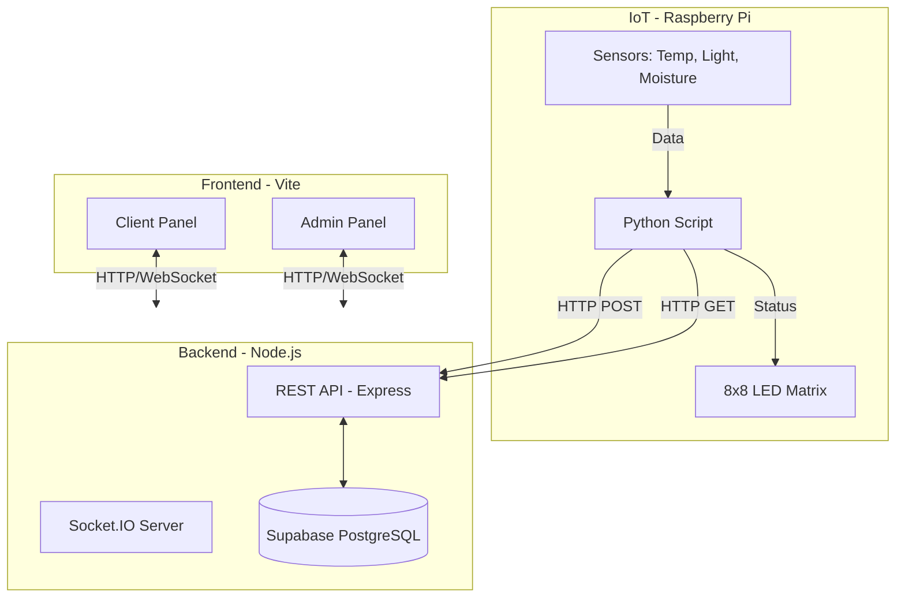

# 🏗️ ECOA Project Architecture

This document describes the technical architecture of the ECOA smart plant monitoring system. The system is composed of three main components: Backend, IoT (Raspberry Pi), and Frontend (Web Clients).

## General Diagram

## 1. Backend (Server)

The core of the system is a RESTful API built with Node.js and Express.

- **Technologies**: Node.js, Express.js, Socket.IO.
- **Database**: Supabase (PostgreSQL).
- **Main Functions**:
    - User, plant, and alert management.
    - Sensor data processing.
    - Real-time communication via WebSockets.
    - Integration with external APIs (Weather API, Perenual).

### Folder Structure (`backend/src`)
- `controllers/`: Controller functions for API endpoints.
- `db.js`: Supabase connection.
- `models/`: Data models for database operations.
- `routes/`: API endpoint definitions.
- `services/`: Business logic and integrations.

## 2. IoT (Raspberry Pi)

The hardware component responsible for monitoring physical plants.

- **Hardware**: Raspberry Pi, Sensors (DS18B20, BH1750, YL-69), MAX7219 LED Matrix.
- **Software**: Python.
- **Workflow**:
    1. **Reading**: Reads sensor data every 5 seconds.
    2. **Processing**: Calculates plant status (healthy, recovering, bad) locally.
    3. **Sending**: Sends data and status to the Backend via HTTP POST.
    4. **Feedback**: Queries the Backend for which emoji to display on the LED matrix (based on plant status).
    5. **Visualization**: Displays the emoji on the 8x8 LED matrix.

### Key Files (`raspi/`)
- `main.py`: Main script orchestrating sensor reading and communication.

## 3. Frontend (Web Clients)

The user interface for interacting with the system. Built with Vite, it serves two distinct applications from the same project.

- **Technologies**: HTML5, CSS3, JavaScript (ES6+), Vite.
- **Structure**:
    - Does not use a complex SPA framework (like React/Vue) to keep it lightweight, using modular Vanilla JS instead.
    - **Client Panel** (`frontend/public/client`):
        - Personal dashboard for users.
        - Real-time metrics visualization.
        - AI chat for care advice.
    - **Admin Panel** (`frontend/public/admin`):
        - Global system management.
        - User and plant administration.
        - General statistics.

### Communication
- **REST API**: For CRUD operations (create plants, users, etc.).
- **Socket.IO**: To receive instant updates of metrics and alerts without reloading the page.
